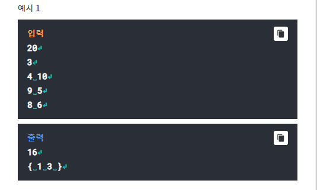
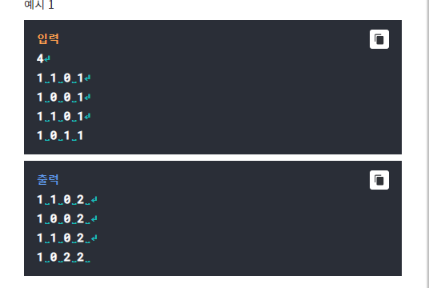

# Q1- Knapsack
## Priority Order Algorithm 

Knapsack 문제란 물건의 무게와 값어치를 정해 배낭에 가장
효율적으로 담을 수 있는 알고리즘을 작성하는 것이다. 배낭에
담을 수 있는 최대 무게 이하의 범위에서 담은 물건들의 값어치의
총합이 최대가 되도록 물건을 넣어야 ㅎㄴ다.
첫 번째로 배낭에 넣을 수 있는 최대 무게 W를 입력받는다. 그
다음 물건 개수 N을 입력 받는데, N은 1이상 100 이하의 
정수이다.
그 다음부터 N줄에 걸쳐 각각의 물건의 무게와 값어치를 
입력받는다.
위의 입력을 바탕으로 배낭에 최대로 넣을 수 있는 값어치의 
총합을 출력하고, 배낭에 들어간 물건의 번호도 집합 형식으로
출력하라(집합 원소 사이에는 콤마 대신 공백 삽입). 물건의
번호는 1부터 시작하며, 작은 숫자부터 출력해야 한다. 동일한
값어치의 총합이 있을 경우 물건을 담는 우선 순위는 앞에 있는 
것부터 담도록 한다.

Testcase 1  
-----------

# Q2- Mining
## map

어떤 채굴회사가 광산에서 다이아몬드 채굴작업을 시작하려고
한다. 
이 회사는 이동비용을 절감하기위해 채굴을 시작하기에 앞서
다이아몬드가 매장되어있는 곳의 구역을 번호매기기로했다.
NxN 크기로 주어진 지도에서 1로 표시된 부분이 다이아몬드가
매장되어 있는 곳의 좌표이다.
다이아몬드가 서로 인접해 있는 곳을 한 구역으로
정의한다. 여기서 인접이라는 것은 상하 도는 좌우로
다이아몬드가 연결되어 있는 것을 이야기한다. 대각선상에 있는
경우는 인접한 것이 아니다.

좌측 최상단부터 탐색을 수행하며, 탐색은 첫째 줄부터 탐색한 후
첫째 줄에서의 구역 탐색이 끝나면 둘째 줄의 탐색을 수행한다.
탐색 중에 먼저 발견한 채굴지역부터 구역 번호를 매겨서 지도에 표시를 한다.
아래 광산지도에서는 구역이 2개로 표시되는데 구역 번호는 
1번과 2번이 된다.
단, 지도의 크기는 10*10까지이다.

Testcase 1  
-----------

# Q3- tug of war
## missing data

