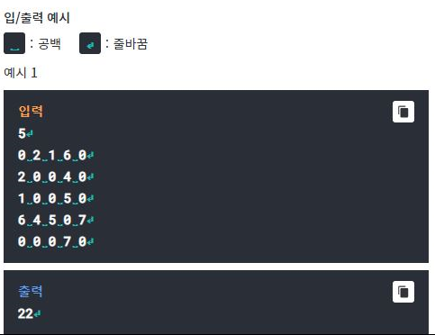
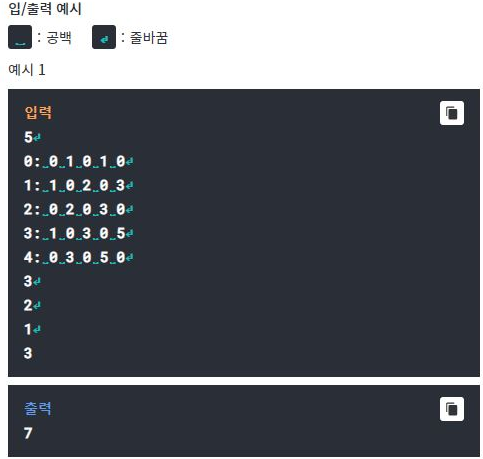

# Q1- MST
## 최대신장트리

여러 가구 사이에 전화를 설치하기 위해 전화회사에 작업을
맡겼는데 설치한 전화선의 길이에 비례하여 설치비를 받는다고
한다.
악덕 전화회사에서는 최대한 비용이 많이 들게 하여 많은 돈을
받으려고 할 것이다.
모든 가구를 연결하며 최대의 비용으로 전화회선을 설치할 수 
있는 최대신장트리를 구하라.

입력의 첫째줄에는 가구의 수를 입력받는다.
인접행렬과 비슷한 개념으로 가구 사이에 설치해야하는 전화선의
길이를 행렬로 입력받는다.

출력은 최대신장트리를 구해서 가중치의 합을 구한다.

Testcase 1  
-----------

# Q2- Floyd Warshall
## Dijkstra Algorithm

다익스트라(Dijkstra) 알고리즘이란 단일 시작점 최단경로
알고리즘으로, 시작 정점에서부터 다른 정점까지의 최단 거리를
구하는 알고리즘이다. 이 알고리즘을 이용하여 주어진 출발점과
어느 한 정점을 지나 도착점에 도달하는 최단거리를 구하는
프로그램을 작성하라.
제일 먼저 테슽트 케이스의 개수(T<=5)를 입력받는다. 그다음
노드의 개수 N(3<=N<=20)과 간선의 개수를 E(1<=E<=100)를 
입력받는다. 그 다음 줄에 걸쳐 연결된 간선과 그 간선의
가중치를 입력받는다. 여기서 가중치란 비용으로 인식하여
가중치가 적을수록 비용이 적게 드는 것이다.
마지막 줄에는 출발점 S, 꼭 지나야하는 정점 A, 그리고 도착점
F를 차례로 입력받는다.
위의 입력을 바탕으로 어느 한 정점을 꼭 지나 출발점과 도착점
사이의 최단 경로 비용을 출력하는 프로그램을 작성하라.
경로비용은 경로상의 모든 간선들의 가중치의 합이고, 최단경로는 
경로비용이 가장 작은 경로이다. 경로가 존재하지 않으면 -1을
출력하라. 단, 지났던 정점을 다시 지나갈 수 있다.

Testcase 1  
-----------

# Q3- RPG
## Collecting Items

RPG 게임의 용사인 당신은 탐험을 하려고 한다.
아이템을 모두 모으는 것이 탐험의 목표인데, 아이템은 무조건
순서대로 모아야만 한다.
게임 안에는 20개 이하의 지역들이 있다. 각 지역을 통행하는
데에는 골드(통행료)가 부과된다.
당신은 0번 마을에 있으며, 수중에는 얼마 안 되는 골드가 있다.
골드가 얼마 없기 때문에 당신은 골드를 최소한으로 사용하여
지역을 이동하려고 한다.
당신은 인터넷에서 검색해 본 결과 지역 간 통행료에 대한 정보가
공략집에 나와있는 것을 확인했다.
공략집에는 다음과 같이 정보가 입력되어 있다. 지역 간 통행료는 
무조건 1 이상이므로, 해당 지역과 연결되어 있지 않다면 0으로
기록되어 있다.

만약 정보가 "1: 1 0 2 0 5" 이렇게 주어졌다면,
1번 마을에서 0번 마을로 이동하는 데 1골드가 들고,
1번 마을에서 1번 마을로는 이동할 수 없고(원위치이므로),
1번 마을에서 2번 마을로 이동하는 데 2골드가 들고,
1번 마을에서 3번 마을로는 곧바로 이동할 수 없고,
1번 마을에서 4번 마을로 이동하는 데 5골드가 든다고 해석할 수 있다.

지역의 수 L과 L줄의 공략집의 정보들(0~L-1. 지역번호
순서대로 주어진다), 모아야 하는 아이템의 수 l와 ㅣakszmadml
아이템의 위치들이(모아야 하는 순서대로 주어진다) 순서대로
주어질 때,
0번 지역에서 부터 시작하여 마지막 아이템이 있는 지역까지
가려면 골드가 얼마나 필요한지 구하여라.
지역은 모두 이어져 있으며, 같은 지역을 여러 번 방문할 수는
있지만 연속해서 같은 지역을 방문하지는 않는다.
자세한 것은 아래의 입출력 예시를 확인하라.

Testcase 1  
-----------

