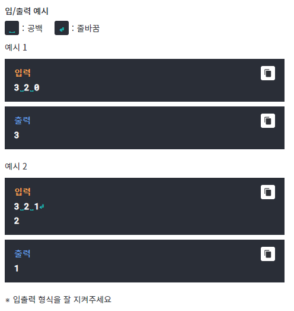

# Q1- Stepping Stone
## 

어떤 미끄러운 돌이 있는 징검다리가 있다.
미끄러운 돌을 밟지 않고 건너는 모든 경우의 가짓수를 출력하는
프로그램을 만들어보자.

한번에 최대로 건널 수 있는 돌의 개수 주어진다. 돌은 N개 이다.
(1~N)
만약 2가 주어지면 한 번에 1개 또는 2개를 건널 수 잇다.

첫번재 돌을 밟기 직전 위치에서 시작하여, 마지막 돌 N을 밟으면
건너편에 도착한 것으로 간주한다.
마지막 돌은 안전함이 보장된다.
최소 한 가지 이상 건널 수 있는 방법이 있도록 주어진다.

돌의 개수 N, 한번에 최대로 건널 수 있는 돌의 개수 M, 미끄러운 
돌의 수 K가 주어지고,
다음줄부터 미끄러운 돌 번호가 K개의 줄에 걸쳐 주어진다.
단, K가 0일 경우 돌 번호는 주어지지 않는다.
예를 들어, 3개의 돌이 주어지고, 한번에 최대로 건널 수 있는
돌의 개수가 2이고 미끄러운 돌이 없는 경우,
3개의 돌을 건너는 방법은 다음과 같이 3가지 경우이다.

1 2 3 

1 3 

2 3 

두번 째 예로, 3개의 돌이 주어지고, 한번에 최대로 건널 수 잇는
돌의 개수가 2이고, 미끄러운 돌이 1개 잇는데 2번째 돌이
미끄러운 돌인 경우,
3개의 돌을 건너는 방법은 다음과 같이 1가지 경우밖에 없다.
첫번째 예어서 2번 돌이 포함된 경우를 제외한 것이다.
 1 3

Testcase 1  
-----------

# Q2- LCS
## missing Data

# Q3- palindrome
## missing Data

