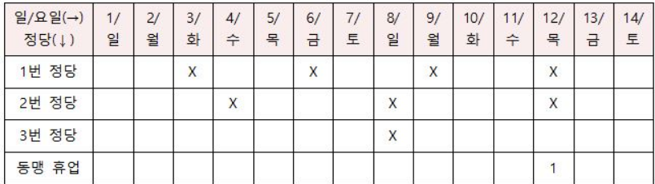
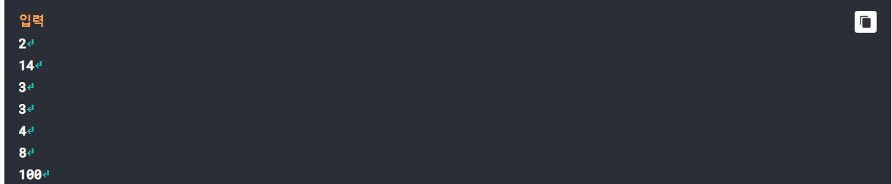
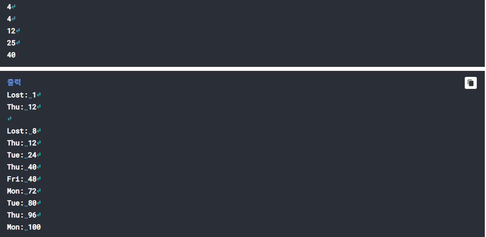
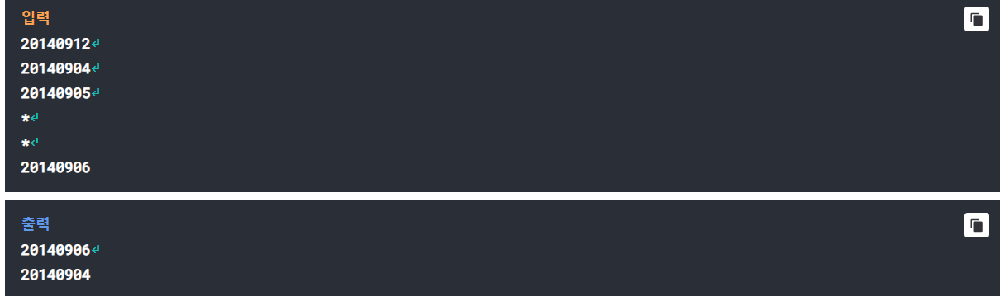
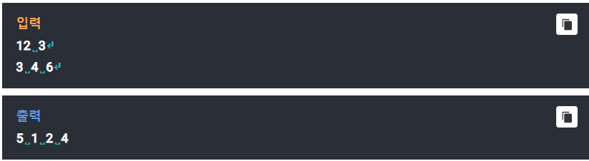

# Q1-동맹 휴업
## hartals

어떤 나라의 정당들은 정기적인 동맹 휴업(파업)을 추진하는데, 이 동맹 휴업이 국민들을 힘들게 하고, 경제에 상당한 피해를 끼치다
보니 결국에는 동맹 휴업 추진에 앞서 두 가지 규칙을 도입하기로 했다.

	1. 매 주 수요일은 '무조건 일 하는 날'로 정하여 동맹 휴업을 할 수 없다. 
	2. 정당들 중 반 이상이 동맹 휴업을 추진한 날에만 휴업을 할 수 있도록 한다.

이 문제에서는 각 당을 동맹 휴업 지수라고 부르는 h라는 양의 정수로 나타낼 수 있다고 하자. 동맹 휴업 지수는 한 동맹 휴업과 다음
동맹 휴업 사이의 기간을 날짜 수로 표시한 값이다. 

3개의 정당이 있다고 하자. i번째 당의 동맹 휴업 지수를 h(i)라고 할 때, h(1) = 3, h(2) = 4, h(3) = 8이라고, 가정하겠다. n(n=14)일
동안의 3당의 행보를 시뮬레이션 하면 다음과 같이 표시할 수 있다. 시뮬레이션은 항상 일요일에 시작하며 주말은 휴일이므로 동맹 
휴업이 없다고 가정한다.

Table 1  
-----------

이 결과를 보면 14일 동안 1번의 동맹 휴업(12일)이 있음을 알 수 있다. 3, 6, 9일의 경우 휴업을 해도 되는 날이긴 하지만 반 이상의
정당이 추진하지 않았으므로 휴업이 일어나지 않았고, 8일은 반이상의 정다이 휴업을 추진하였으나 주말이기에 동맹 휴업이 일어나지 
않았다. 4일은 반 이상의 정다잉 추진하지도 않았지만, 만약에 추진한 정다이 둘 이상이었다고 하더라도 수요일 이므로 휴업이 추진되지
않는다.
입력으로 테스트케이스의 수가 먼저 주어지고, 그 다음 줄부터는 시뮬레이션을 위한 일수 n과 몇 정당의 동맹 휴업 지수가 주어졌을 때, 
n일 가운데 동맹 휴업으로 인해 일을 하지 않은 근무 일수를 계산하고, 휴업을 하는 요일과 날짜를 출력하라.

입력을 간략하게 정리하여 보자면,

* c (테스트케이스의 수)
* n (시뮬레이션을 할 날짜 수)
* p (정당의 수)
* h(1) (1번 정당의 휴업 지수)
* ..
* h(p) (p번 정당의 휴업 지수)

이렇게 도니다.

출력은 다음과 같다.

* Lost: 동맹 휴업으로 인해 일을 하지 못한 근무 일수
* (휴업하는 날의) 요일 이름 : 날짜
* ...

출력 문에서 각 테스트 케이스 사이에는 빈 줄 하나를 삽입하도록 하며, 요일 이름의 경우 일요일부터 토요일까지 Sun, Mon, Tue,
Wed, Thu, Fri, Sat의 양식으로 표현하면 된다. Lost: 와 숫자 사이, 요일: 과 숫자 사이에는 반드시 공백이 하나 있어야 한다.

Testcase 1  
-----------

# Q2- 유통기한
## Expiring Date

마트 알바는 진열대에 우유를 한 개씩 추가하고, 마트에 오는 손님은 항상 유통기한이 제일 많이 남는 우유를 집는다고 가정하자. 입력 각 줄에는 알바의 우유 추가
(유통기한을 숫자로 표시) 혹은 손님이 우유 집는 것(\*로 표시)이 있다. 마트가 문을 닫고 나서, 아직 안 팔린 우유를 유통기한이 많이 남은 순서대로 출력하라.
진열대에는 최대 200개의 우유를 진열할 수 있다.

Testcase 2  
-----------

# Q3- RARE
## UltraRare - SuperRare - Rare - Normal 

지정 숫자 여려 개가 주어졌을 때, 그 숫자들 중 세 개 이상의 배수에 해당하면 울트라 레어, 두 개 이상이면 슈퍼
레어, 한 개 이상이면 레어, 어느 지정 숫자의 배수도 아니면 노멀이라고 하자. 단, 2의 거듭제곱은 무조건 울트라
레어로 정의한다. 예를 들어 지정 숫자가 3, 4, 6이라면

1: 울트라 레어 (2의 거듭제곱) 
2: 울트라 레어 (2의 거듭제곱) 
3: 레어 (3의 배수) 
4: 울트라 레어 (2의 거듭제곱) 
5: 노멀 
6: 슈퍼 레어 (3과 6의 배수) 
7: 노멀 
8: 울트라 레어 (2의 거듭제곱) 
9: 레어 (3의 배수) 
10: 노멀 
11: 노멀 
12: 울트라 레어 (3, 4, 6의 배수) 

입력 첫째 줄에는 숫자 n과 m이 있다(n <= 10000, m <= 100). 둘째 줄에는 지정 숫자 m개가 있다. 1부터
n까지의 숫자 중 울트라 레어, 슈퍼 레어, 레어, 노멀이 가가 몇개 인지 출력하라.

Testcase 2  
-----------

