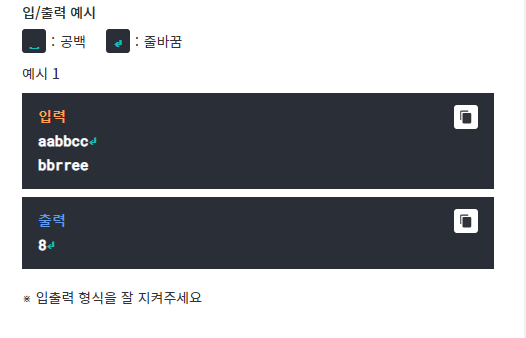
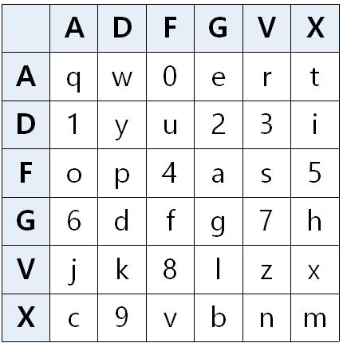
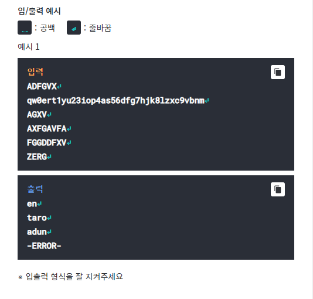
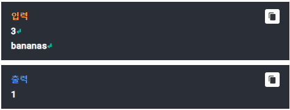

# Q1- 애너그램
## anagram

두 영어 단어가 철자의 순서를 뒤바꾸어 같아질 수 있을 때, 이 두
단어는 애너그램(anagram) 관계에 있다고 한다.
예를 들어, occurs와 succor는 서로 애너그램 관계에 있다고 할 수 
있는데, occurs의 각 문자들의 순서를 잘 바꾸면 succor이 되기 
때문이다.
두개의 영어 단어가 주어졌을 때, 단어가 서로 애너그램 관계에 
있도록 만들기 위해 제거해야하는 최소 개수의 문자 수를
구하여라.
문자를 제거할 때에는 위치에 상관없이 제거할 수 있다.

-----------

입력
첫째 줄과 둘째 줄에 영어 단어가 소문자로 주어진다. 각 단어의
길이는 1이상, 1000 이하이다.

출력
제거해야 할 문자의 최소 개수를 출력한다.
이 때, 최소 개수는 두 단어 각각 제거되는 문자 개수의 합이다.

Testcase 1  
-----------

# Q2- ADFGVX
## Encrypted Code

1차 세계대전에 독일군이 사용하던 'ADFGVX'라는 암호가 있다.
이 암호를 간략하게 설명하자면, 6*6의 표를 만든 뒤, 그 배열 안에
26자의 알파벳 소문자와 10개의 숫자(0~9)를 무작위로
집어넣는다.

그리고 1행과 1열은 'A', 2행과 2열은 'D', 3행과 3열은 'F', 4행과 
4열은 'G', 5행과 5열은 'V', 6행과 6열은 'X'라는 이름을 붙인다.
상기한 설명을 간략하게 표로 작성해보면 다음과 같다.

table 1  
-----------

여기에서 행과 열에서 한 자씩 따오는 식으로 암호를 작성한다.
"q"의 경우 "AA"로 암호화 시킬 수 있다.
암호문이 "VVAGAVFG AXDFVG"이라고 주어지면, "zera tul"로
해독할 수 있다. 각 행과 열의 이름은 대소문자를 구분하지 않도록
하여, "vvAgAvFg aXDFvg" 역시 "zera tul"로 해독할 수 있다.

입력으로 행/열의 이름과 배열 안에 채워 넣을 36자의 숫자와
알파벳이 주어지고, 여러 줄로 된 암호문들이 주어진다. 쥬오잔
암호문을 해독하여 출력하면 된다. 해독할 수 없는 경우 에러
메세지를 출력시킨다.
암호문은 알파벳이 대소문자 가리지 않고 들어가 있으며, 숫자나
특수문자가 들어가 있을 수도 있다. 다른 특수문자가 들어 있다면
해독할 수가 없으므로 에러 메세지(-ERROR-)를 출력해야 겠지만,
암호문 안에 띄어쓰기가 있다면 띄어쓰기는 그대로 출력해야
한다. 암호문은 각 줄마다 100자를 넘기지 않는다.

Testcase 1  
-----------

# Q3- Unity Of String
## 문자열의 통일성

문자열의 '통일성'이란, 얼마나 적은 종류의 알파벳으로
구성되었는가 하는 것이다. 문자열 'bananas'의 연속한 3글자
구간을 살펴보자. ban, ana, nan, ana, nas 중 ban과 nas에는
3종류의 알파벳이 있고, ana, nan, ana에는 2종류의 알파벳이
있다. 따라서 ban, nas는 상대적으로 통일성이 낮고, ana, nan,
ana는 상대적으로 통일성이 높다.

입력 첫째 줄에는 숫자 n이 있다. 입력 둘째 줄에는 최소 n글자,
최대 10000글자의 문자열이 있다. 문자열에서 연속한 n글자 구간 
중 통일성이 제일 높은 것은 어느 것인지 그 첫 index를 출력하라.
만약 통일성이 제일 높은 것은 어느 것인지 그 첫 index를 출력하라.
만약 통일성이 제일 높은 구가이 여러 개 있다면, 그 중 첫번째
구간으로 한다. 아래 예제에서는 통일성이 제일 높은 3글자 구간
ana, nan, ana 중 첫번째 구간인 ana의 index가 1이다.
\* 문자열은 영소문자로만 구성
\* index는 0부터 시작

Testcase 1  
-----------

