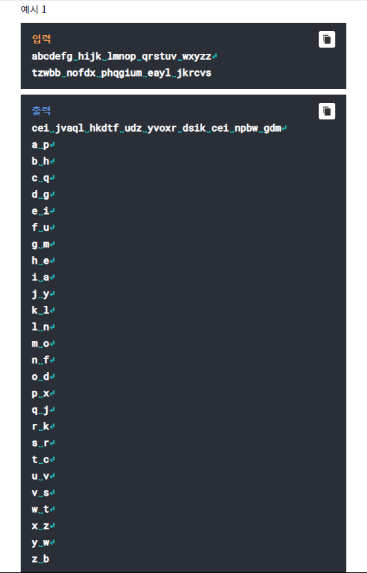
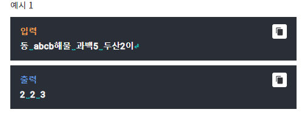

# Q1- String Rotation
## missing data

# Q2- Encryption
## Alphabet Encryption

알파벳의 한 글자씩 다른 글자로 치환해서 암호를 만들었다고
하자. 입력 첫째 줄에는 암호화하지 않은 단어 n개가 있다. 둘째
줄에는 그 단어들을 암호화한 것 n개가 있는데, 순서는 섞여 있다.
총 단어의 수 n은 최대 20개이고, 한 단어는 최대 10글자이다.
이 단어들을 이용해 어떤 글자가 어떤 글자로 암호화되는지를
알아내, the quick brown fox jumps over the lazy dog의 
암호화된 버젼을 출력하고 a부터 z가 어떠한 글자로 암호화
되었는지 오름차순으로 출력하라.

Testcase 1  
-----------

# Q3- String Tower
## triangle shape

한 문자열이 UTF-8 형식으로 주어진다. 이 문자열에는 Unicode로 
아스키 문자와 한글이 포함되어 있다. 한자나 (띄어 쓰기를
제외한) 특수문자는 없다고 가정한다.
이 문자열을 삼각형 모양으로 쌓는다.(첫 번째 줄에는 한 글자, 두
번째 줄에는 두 글자, ..., n 번째 줄에는 n 글자)
"가나다 adcd"가 입력되었다면

가
나다
 ab
cd

이런 식으로 길이가 되는 대로 쌓는 것이다.
삼각형 모양으로 쌓은 후에 가장 앞에 등장하는 글자들을 세로로
읽는다. 띄어 쓰기가 등장한다면 띄어 쓰기가 등장하기 이전
문자열을 한 단어로 친다. 띄어 쓰기가 맨 처음부터 나오거나 
연속하여 등장하는 경우는 없다.
세로로 읽었을 때 띄어 쓰기가 전혀 등장하지 않고 띄어 쓰기를
제외한 문자들만 나왔다면 한 단어가 등장한 것으로 본다.

위의 예에서는 "가나c"로 읽히고 단어 수는 2개, 공백 제외
아스키 코드는 1개, 한글 코드는 2개가 되므로 2 1 2를 출력해야
한다.

한 줄의  입력이 UTF-8 형식으로 입력되며, 출력은 입력에 대해 한 
줄에서 나타난 전체 단어 개수, 띄어 쓰기를 제외한 아스키 글자
개수, 한글 글자 개수를 공백으로 띄어 출력하면 된다.

한 줄에는 31줄 이내의 삼각형을 만들 수 있는 문자열이 입력된다.

Testcase 1  
-----------

