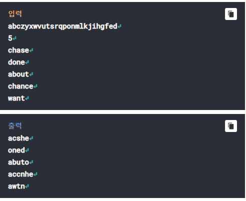
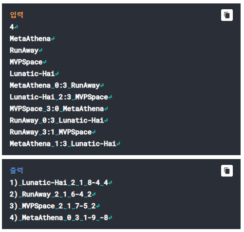

# Q1- Expiration Date
## missing data

# Q2- Priority Order
## Alphabet Order

일반적으로 영어단어를 정렬할 때 a로 시작하는 단어들이 맨 앞에
오고, b로 시작하는 단어들이 그 다음 등으로 정렬된다. 글자의
우선순위가 a b c d ... x y z 순으로 되어 있는 것이다.
이 문제에서는 입력 첫째 줄에 a..z가 한번씩 나오는 문자열이
있는데, 이것으로 글자의 우선순위를 새롭게 지정한다. 입력 둘째
줄에는 총 단어의 개수 n이 있고, 그 후 n줄에 걸쳐서 단어가 있다.
단어들을 새로운 우선순위에 따라 정렬해서 출력하라.

Testcase 1  
-----------

# Q3- Tournament
## football

게임 대회 조별리그를 진행한다. 한 조에 n개의 팀이 들어가 리그를 
진행하며, 순위를 매긴 후 상위권의 성적을 거둔 팀들만 상위 
토너먼트에 진출할 수 있다.
특정 조의 팀명과 팀별 게임 결과들이 들어오면, 그것을 토대로 해당
조의 순위표를 출력해야 한다.
조 안의 모든 팀들은 조 안에 있는 모든 상대와 게임을 진행하므로, 
게임 수에 있어서 순위를 결정해야 하는 문제는 발생하지 않는다.

조별리그의 순위 규칙은 다음과 같다.
1. 무승부는 발생하지 않으며, 1차적으로는 승리한 게임 수가 높은
순서대로 순위를 결정한다.
2. 승리한 게임 수가 동일하다면 세트득실점으로 순위를 구분한다.
3. 세트득실점이 같다면 승자결정전 없이 승자승(두  팀간의 이전
경기에서 승리했었던 쪽을 이긴 것으로 치는 것)을 적용한다.
(3개 이상의 팀이 승리한 게임 수와 세트득실이 모두 같은 경우는
없다고 가정한다.)

입력으로 들어오는 팀명 및 게임 결과의 양식은 다음과  같다.
팀명에는 띄어쓰기가 없으며, 팀명과 스코어간에는 띄어 쓰기로
구분되어 있다.
한 조에 있는 팀의 수
팀1
팀2
...
팀명A 스코어[a:b] 팀명B
...

출력해야 하는 순위표의 양식은 다음과 같다.
순위) 팀명 승 패 세트[이긴세트-진세트] 세트득실점
...
순위표에서 각 카테고리는 띄어 쓰기로 구분하며, 팀명은 20자를 
넘지 않는다.

Testcase 1  
-----------

