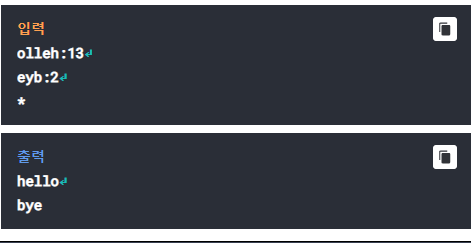
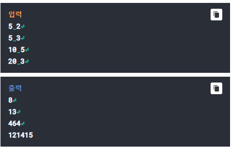

# Q1- Subset
## missing data

# Q2- Anagram2
## cat

문자를 바꾸어 나열할 수 있는 모든 가능성을 구하는 것을
'아나그램(anagram)'이라고 한다.
예를 들어 "cat"의 아나그램은 "cat", "cta", "act", "atc", "tca",
"tac"이다. 이것을 이용하여 암호를 만든다.
암호는 "[7자 이하의 단어]:[1 이상의 정수]" 이렇게 주어지며,
이것을 복호화 하는 과정은 다음과 같다.

1. 단어의 아나그램들을 구한 후, 중복되는 아나그램들을 없애고
오름차순으로 정렬한다.
2. 주어진 정수 번째에 위치하는 아나그램을 출력한다.

입력으로 암호가 주어지면 이것을 복호화하여 출력하라. 입력의 
끝은 *이다.

Testcase 1  
-----------

# Q3- Fibonachi
## Picking the ball

한 상자에 N개의 공이 있고 한번에 1~K개의 공을 꺼낼 수 있다.
N과 K가 주어질 때 상자에서 공을 꺼낼 수 있는 방법의 개수를 
출력하시오.

예를 들어 N=3, K=2인 경우 공을 꺼낼 수 있는 방법은

1 1 1
1 2 
2 1

그러므로 총 개수는 3이 된다.

입력으로는 N과 K가 수서대로 주어지며 N은 20을 넘지 않는다.

###<공 뽑기 문제 힌트>

N개의 공을 최대 K개 만큼 공을 꺼내는 수를 계산하는 문제입니다.

만약 공이 10개가 있고 최대 3개의 공까지 뽑을 수 있다고 가정하면 모든 
경우의 수는(x)는

공 9개를 뽑는 경우에서 공 1개를 뽑는 방법 + 공 8개를 뽑는 경우에서 공 2개를 
뽑는 방법 + 공 7개를 뽑은 경우에서 공 3개를 뽑는 방법의 합입니다.

즉 F(10) = F(9) + F(8) + F(7) 입니다.
만약 최대 4개를 뽑을 수 있다면
F(10) = F(9) + F(8) + F(7) + F(6)이 될 것입니다.

이 문제는 자세히 살펴보면 피보나치 수열의 방법과 동일합니다.
이 원리를 깨닫는다면 쉽게 코딩을 할 수 있습니다.

제 코드에서는 피보나치 계산을 위해 재귀를 이용하지 않고 배열을
이용합니다.

그리고 한번에 뽑을 수 있는 개수 K에 따라서 F(N)의 값이 달라지게 됩니다.
만약 K가 5보다 작으면 위에서 보셨던 것처럼
F(5) = F(4) + F(3) + ... + F(5-K)가 될 것입니다.

하지만 K가 5보다 같거나 큰 경우 다섯개를 한번에 뽑을 수 있으므로 기존 
방식에서 +1을 해줘야 합니다.

그래서 F(5) = F(4) + F(3) + ... + F(5-K) + 1이 되며
이는 사실상 F(5) = F(4) + F(3) + ... F(1) + 1과 같습니다.

Testcase 1  
-----------

