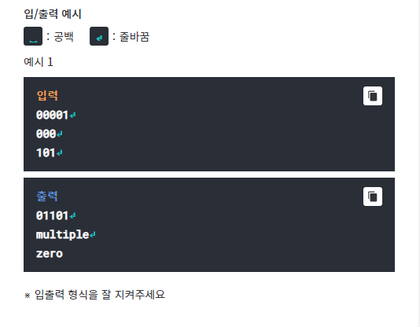

# Q1- Binarynumber
## missing data

# Q2- 0 & 1
## Sequence

0과 1로 이루어진 수열이 있다.
각 수열은 한 단계가 지날 때마다 왼쪽 이웃 숫자와 오른쪽 이웃
숫자의 상태에 따라 값이 변한다.
이웃 숫자가 같으면 현재 값을 유지하고 같지 않으면 값이 변한다.

수열은 처음과 끝이 이어져 있다고 가정한다. 즉, N개의 수열에서
첫번째 숫자의 오른쪽 이웃은 두번째 숫자이고, 왼쪽 이웃은 
N번째 숫자이다.

예시는 다음과 같다.

초기값 : 01101
다음값 : 00001

한 수열이 주어 졌을 때 이전의 상태를 구하여 출력하여라.
이전 상태가 여러 개인 경우 "multiple"
이전 상태가 없을 경우 "zero"를 출력한다.
입력 수열의 길이는 3에서 10사이이다.

Testcase 1  
-----------

# Q3- MaxQueen
## missing data

